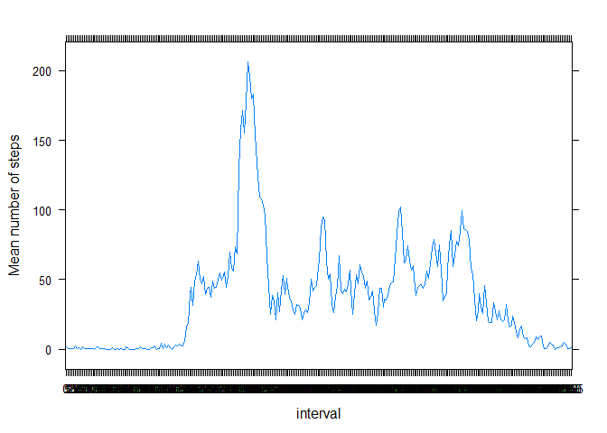
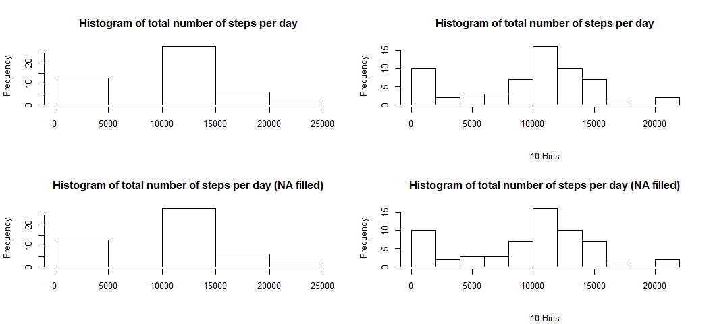
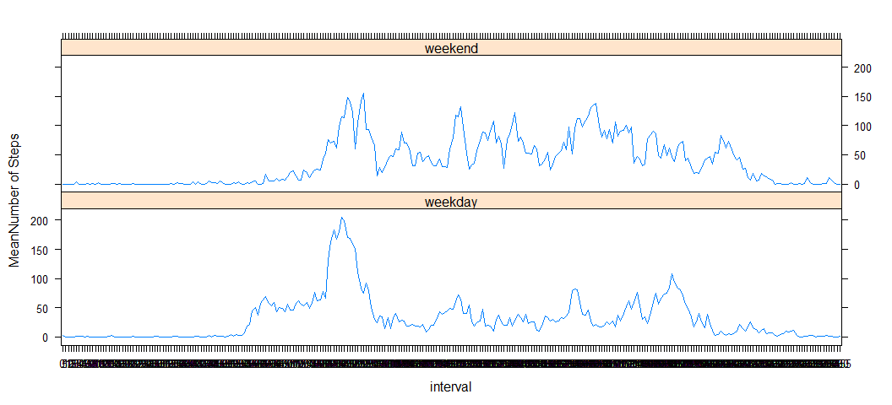

# Reproducible Research Week 2 assignment
Koen Van der Goten  
January 3, 2017  


## Initialization

```r
library(dplyr)
library(ggplot2)
```


## Load file

```r
act <- read.csv(file = "activity.csv", sep = ",", na.strings = "NA", stringsAsFactors = FALSE, header = TRUE)

act2 <- act
act2$date <- as.Date(act2$date)
act2$interval <- as.factor((act2$interval))
```


## What is mean total number of steps taken per day?
+ Firstly, we do a calculation of the sum per day
+ the plot resulting from a simple call to hist is not that nice
+ a second plot is provided with the number of bins increased tot 10
    1. in the second plot it is easier to see the influence of the zero steps bin
    2. If we think the zero bin away, the rest of the distribution looks almost "normal"

```r
TotDaySteps <- act2 %>%
    group_by(date) %>%
    summarise(DaySum = sum(steps, na.rm = TRUE))

op <- par(mfrow=c(1,2))
hist(x = TotDaySteps$DaySum, main = "Histogram of total number of steps per day",  
     xlab = "")
### number of bins set to 10 to increase readibility
hist(x = TotDaySteps$DaySum, main = "Histogram of total number of steps per day", 
     sub= "10 Bins", breaks=10, xlab = "")
```

<!-- -->

```r
par(mfrow=c(1,1))    


MeanSteps <- mean(x = TotDaySteps$DaySum, na.rm = TRUE)
MedianSteps <- median(x = TotDaySteps$DaySum, na.rm = TRUE)
```

+ The mean number of steps per day is : **9354.2295082**
+ The median number of steps per day is : **10395**


## What is the average daily activity pattern?

```r
library(lattice)
MeanDayInterval <- act2 %>%
    group_by(interval) %>%
    summarise(IntervalMean = mean(steps, na.rm = TRUE))
with(MeanDayInterval, xyplot(IntervalMean  ~  interval, type="l", ylab = "Mean number of steps"))
```

<!-- -->

```r
MaxMeanDayInterval <- MeanDayInterval[which.max(MeanDayInterval$IntervalMean),]
```

The highest mean number of steps occurs in interval **835**


## Imputing missing values

```r
# act3 <- act2[ complete.cases(act2), ]
NumberNA <- dim( act2[ !complete.cases(act2), ] )[1]

## only NAs in steps
colSums(is.na(act2))
```

```
##    steps     date interval 
##     2304        0        0
```

```r
# take the median of the intervals (over days) as the filler for the NA
# vectorized solution, replace NA with median of relevant interval
actFilled <- act2
actFilled$steps[is.na(actFilled$steps)] <- with(actFilled, 
                                      ave(steps, 
                                          interval, 
                                          FUN = function(x) median(x, na.rm=TRUE)))[is.na(actFilled$steps)]

### Make a histogram of the total number of steps taken each day and 
### Calculate and report the mean and median total number of steps taken per day. 
### Do these values differ from the estimates from the first part of the assignment? 
### What is the impact of imputing missing data on the estimates of the total daily number of steps?

TotDayStepsNAF <- actFilled %>%
    group_by(date) %>%
    summarise(DaySum = sum(steps, na.rm = TRUE))

op <- par(mfrow=c(2,2))

### Results from before
hist(x = TotDaySteps$DaySum, main = "Histogram of total number of steps per day",  
     xlab = "")
### number of bins set to 10 to increase readibility
hist(x = TotDaySteps$DaySum, main = "Histogram of total number of steps per day", 
     sub= "10 Bins", breaks=10, xlab = "")

### NA Filled
hist(x = TotDayStepsNAF$DaySum, main = "Histogram of total number of steps per day (NA filled)",  
     xlab = "")
### number of bins set to 10 to increase readibility
hist(x = TotDayStepsNAF$DaySum, main = "Histogram of total number of steps per day (NA filled)", 
     sub= "10 Bins", breaks=10, xlab = "")
```

<!-- -->

```r
par(mfrow=c(1,1)) 

MeanStepsNAF <- mean(x = TotDayStepsNAF$DaySum, na.rm = TRUE)
MedianStepsNAF <- median(x = TotDayStepsNAF$DaySum, na.rm = TRUE)
```

+ The shape of the histogram does not change much, the median remains the same, while the mean increases somewhat 
+ The mean number of steps per day is : **9503.8688525** vs **9354.2295082** before
+ The median number of steps per day is : **10395** vs **10395** before (no change)

## Are there differences in activity patterns between weekdays and weekends?

```r
actFilled$Weekday <- weekdays(actFilled$date)

welist <- c("zaterdag", "zondag", "weekend")
actFilled$Weekday[ actFilled$Weekday %in% welist ]  <- "weekend"
actFilled$Weekday[ !(actFilled$Weekday %in% welist) ]  <- "weekday"  
actFilled$Weekday <- factor(actFilled$Weekday)

MeanDayIntervalFilledWeek <- actFilled %>%
    group_by(interval, Weekday) %>%
    summarise(IntervalMean = mean(steps, na.rm = TRUE))

library(lattice)
xyplot(IntervalMean ~ interval | Weekday, data = MeanDayIntervalFilledWeek, type="l", layout= c(1,2), ylab = "MeanNumber of Steps")
```

<!-- -->

+ more activity in the early morning on weekdays
+ more activity in the later evening on weekends
+ more peeks during the day in the weekends
